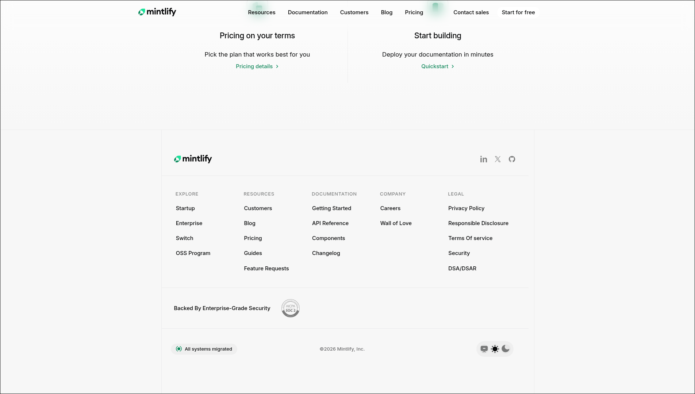

## Mintlify clone

- Pure HTML and CSS
- Desktop only
- Light mode

## Screenshots

_Header_

_Blur effect_

_Footer_

_All Three_

## Note

- Class names are very descriptive so follow them for the code review
- CSS follows the order of HTML (i.e, Nav, Header Company Logos etc)

## Flaws

- Positioning of elements is not pixel perfect
- Header nav needs work
- CSS file has multiple repeated snippets especially colors
